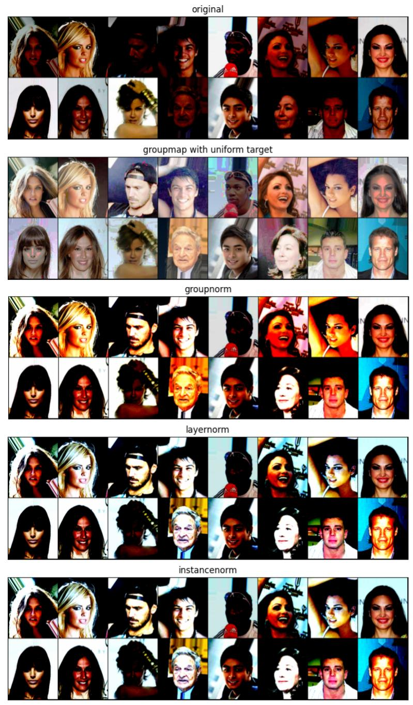

# Group Map: beyond mean and variance matching for deep learning

Define a `GroupMap` module, to apply an optimal transportation map over a multidimensional input. The objective is to transform the input to follow a prescribed arbitrary distribution, like uniform, Gaussian, sparse, etc. 

> The main difference between `GroupMap` and normalization modules like `InstanceNorm`, `LayerNorm` or `GroupNorm` is it enforces the output to match _a whole distribution_ instead of just mean and variance.

> :warning: In this simplified implementation, there is no tracking of the input statistics and the module always uses the batch statistics for mapping, both at training and test time. 

Let $x$ be the input tensor, of arbitrary shape `(B, C, ...)` and let $x_{nc\boldsymbol{f}}$ be one of its entries for sample $n$, channel $c$ and a tuple of indices $\boldsymbol{f}$ corresponding to features. For instance, for images, we would have 2D features $\boldsymbol{f}=(i,j)$ for the row and column of a pixel. 

For each element of the input tensor, the following transformation is applied:

$y_{nc\boldsymbol{f}}=\mathit{Q}\left(\mathcal{F}_{nc}\left(x_{nc\boldsymbol{f}}\right)\right)$

Where:  
* $\forall q\in[0, 1],~\mathit{Q}(q)\in\mathbb{R}$ is the target _quantile function_. It describes what the distribution of the output should be and is provided by the user. The `GroupMap` module guarantees that the output will have a distribution that matches this target.
    > Typically, $\mathit{Q}$ is the quantile function for a classical distribution like uniform, Gaussian, Cauchy, etc.
    $\mathit{Q}(0)$ is the minimum of the target distribution, $\mathit{Q}(0.5)$ its median, $\mathit{Q}(1)$ its maximum, etc.
* $\mathcal{F}_{nc}(v)=\mathbb{P}(x_{nc,\boldsymbol{f}}\leq v)\in[0, 1]$  is the input cumulative distribution function (cdf) for sample $n$ and channel $c$.
   It is estimated on data for sample $n$. Several behaviours are possible, depending on which part of $x_n$ it is computed from.
   * It can be the cdf for just a particular channel $x_{nc}$, then behaving like some optimal-transport version of `InstanceNorm`.
   * It can be computed and shared over all channels of sample $x_n$  (as in `LayerNorm`)
   * It can be computed and shared over groups of channels (as in `GroupNorm`).
    > $\mathcal{F}_{nc}(v)=0$ if $v$ is the minimum of the input distribution, $0.5$ for the median, $1$ for the maximum, etc.).  

This formula corresponds to the classical _increasing rearrangement_ method to optimally transport scalar input data distributed wrt a distribution to another scalar distribution, by mapping quantile to quantile (min to min, median to median, max to max, etc.)  

## Arguments
* `num_groups`: number of groups to separate the channels into
* `num_channels`: the number of channels expected in input, of shape (N, C, ...)
* `target_quantiles`: the target quantiles function. must be a callable that takes a Tensor with entries between 0 and 1, and returns a Tensor with same shape.  
Can notably be one of the provided `groupmap.gaussian` (default) `groupmap.uniform`, `groupmap.sparse`.

## Shapes
* Input: `(N, C ...)`
* Output: `(N, C, ...)` (same shape as input)
